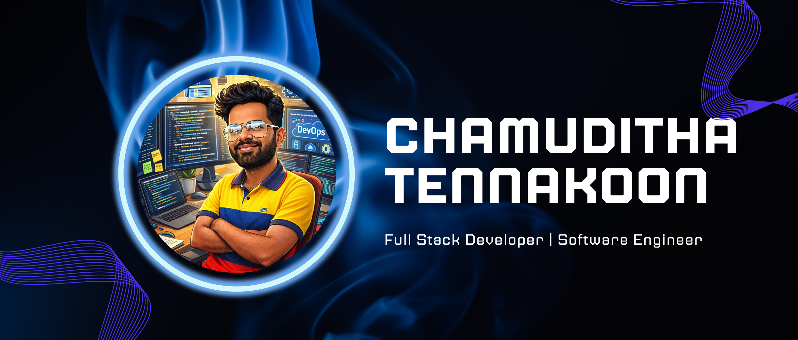

  

  

  

# Hi 👋, I'm Chamuditha Tennakoon

### Software Engineer | Full Stack Developer

Welcome to my GitHub profile!

## 👨‍💻 About Me

- 🎓 Software Engineering Graduate
- 💻 Passionate about Full Stack Web Development
- 🌱 Currently learning Laravel from Beginner to Advanced
- 🚀 Interested in MERN, Spring Boot, CI/CD, K8S, Laravel, AWS, Docker, and DevOps
- 📚 Always learning new technologies and building projects

## 🏆 GitHub Trophies

  

## 🛠️ Tech Stack

### Languages

### Frontend

### Backend

### Database

### Tools & Platforms

### Learning

## 📈 GitHub Analytics

  
  

## 📫 Connect With Me

- 💼 LinkedIn: https://linkedin.com/in/your-linkedin](https://www.linkedin.com/in/chamuditha-tennakoon/
- 🌐 Portfolio: https://yourportfolio.com
- 📧 Email: chamuditha.tennakoon.dev.gmail.com

  

Thanks for visiting my profile! ⭐
